# Aura3D Quality Rebuild: Master Plan (15 parallel lanes)

- Date: 2026-10-05 (Monday). Branch `aura3d-quality-rebuild/audit`. Owner of this file: lane 15 (custodian), `CONTRACTS.md:2442`.
- Authority order: `CONTRACTS.md` (contracts C-01..C-40, ownership §4, flags §5, merge §6, checkpoints §7, soft dependencies §8)
  > this plan > the PRD files. Where this plan and `CONTRACTS.md` disagree, `CONTRACTS.md` wins and this plan is corrected.
- Inputs: `CONTRACTS.md` §0, §2.0, §3.9, §4-§8; `00-AURA3D-AUTOPSY.md` (executive verdict :8-23, root causes :25-42, Quality Bar
  :1945-2082, tiers :2085-2125); PRD-01..15 sections "Contracts consumed / provided", "Parallel execution", implementation phases,
  standalone and integrated acceptance, performance budgets; research 19 (corrected claims), 21 (game vision judgment), 23
  (benchmark vision judgment); `_sections/A-capability-matrix.md:139-158` (per-scene table); `_sections/parallel-conflict-map.md`.
- Pixel baseline: GitHub Actions run **37289688772** (`.github/workflows/quality-rebuild-capture.yml`, macos-14, Chromium ANGLE Metal,
  paravirtual M1 GPU, sha `c08d8acb`), `00-AURA3D-AUTOPSY.md:5`.

**What this plan is not.** It records no visual result. Score columns labelled "target" are thresholds copied or derived from the PRDs'
integrated acceptance tables. They are not forecasts with a measured confidence. The only evidence that can move a number in §5 is a
G-PANEL checkpoint record (`benchmarks/quality-rebuild/history/rounds/IC-<k>.json`, `CONTRACTS.md:2700-2707`). Conformance tests,
engineering gates, metric thresholds and vision-only screening rounds never support a claim that Aura3D matches three.js
(`CONTRACTS.md:2720-2727`).

---

## 1. Execution model

### 1.1 One bootstrap, then fifteen lanes at once

There is no serial order between lanes (`00-AURA3D-AUTOPSY.md:137-146`). The program is:

1. **PR 0 Contract Bootstrap, day 0-2 (2026-10-05..07)**, owned by lane 15 and executed first by whichever agent starts
   (`CONTRACTS.md:2351-2413`). Rule: PR 0 changes no rendered pixel, no public signature (optional additions only) and no default
   (`CONTRACTS.md:2353`).
2. **All 15 lanes start on day 0 (2026-10-05)** in their own new files, branched from the PR 0a branch, which is pushed within hours
   (`CONTRACTS.md:2400-2403`). No lane waits for PR 0a to *merge*, and no lane waits for any other lane at any point.
3. **Lanes merge to main whenever they are green, behind their own `A3D_QR_*` flag** (`CONTRACTS.md:2627-2639`). Consumers build against
   PR 0 stubs; providers swap stub for real with `slot.provide(real)` in their lane barrel, so a swap is a flag flip and no consumer code
   changes (`CONTRACTS.md:2650-2657`).
4. **Integration is measured, never awaited.** Weekly checkpoints IC-1..IC-n (Thursdays from 2026-10-15) and G-PANEL rounds every 4th
   checkpoint (IC-4, IC-8, IC-12, …) score the all-flags build. A failure becomes a `qr-ic-regression` issue against the attributed lane;
   that lane's flag is not promoted; nothing else is held (`CONTRACTS.md:2709-2718`).

### 1.2 PR 0 exact scope (`CONTRACTS.md:2355-2398`)

| Part | Day | Scope | Who may start after it |
|---|---|---|---|
| **PR 0a** (additive only) | 0 (2026-10-05) | (1) `packages/rendering/src/contracts/` — `core, frameGraph, program, materialLobes, blend, output, geometry, frameUniforms, environment, shadows, sampling, post, velocity, textureFormats, deform, particles, atmosphere, quality, device, rendererFactory, renderItem, renderSource, index` + `testing/ChunkHarness.ts`. (2) `packages/engine/src/contracts/` — `flags, output, sceneGraph, environment, lighting, post, materials, assets, animation, effects, atmosphere, camera, time, game, world, diagnostics, looks, art, compiler, runtimeNodes, app, index` + `stubs/*.ts` (each stub = exactly its catalog "Stub" paragraph). (3) `packages/assets/src/contracts/decoders.ts`, `packages/animation/src/contracts/pose.ts`, `packages/audio/src/contracts/gameSound.ts`, `packages/aura3d-cli/src/contracts/{assetManifest,commands}.ts`, `packages/aura3d-cli/src/commands/{registry.ts,prdNN/index.ts}`. (4) Declaration-only optional fields on existing types for C-04, 06, 07, 10, 12, 13, 14, 15, 16, 17, 18, 19, 27, 28, 30, 31, 37, 38. (5) Lane barrels, subpath reservations, `packages/game` skeleton, `eslint/qr/*.js`, benchmark lane scene indices, `tools/quality-rebuild-capture/games.schema.json` + `contracts.mjs`, `tools/quality-gate/src/contracts.ts`. (6) Conformance harness and every `tests/unit/contracts/C-NN-*.test.ts` / `tests/browser/contracts/*.spec.ts` green on stubs. (7) `.github/workflows/qr-contracts.yml`, `.github/QR_OWNERSHIP.json`, `tools/qr-ownership/check.mjs`. | Every lane, for every contract in the "no 0b seam" set: C-02, 03, 04, 06, 07, 08, 10, 15, 17, 19, 20-27, 30, 32, 35 (`CONTRACTS.md:2405-2408`). C-40 needs no PR 0. |
| **PR 0b-1** | 1-2 (2026-10-06..07) | Verbatim carve-outs of `packages/engine/src/agent-api/index.ts` (18,733 lines, §3.2) into lane modules; C-36/C-37/C-38/C-31/C-34 seams; extra carve of `GameRuntime.ts` `GameEffectKind` :1150-1171, `createGameEffects` :2800-2879, `effectToSceneNode` :3879-3915 into `agent-api/vfx/gameEffects.ts` (07) (`CONTRACTS.md:2410-2412`). | Lanes editing carved `agent-api` regions (02 `compiler/{environment,lights,shadows}.ts`, 03 `compiler/postprocess.ts`, 06 `app/actorAnimationHandle.ts`, 07 `compiler/{fog,effects,sky}.ts`, 11 `app/rendererOptions.ts`, 13 `looks/generatedCodeWarnings.ts`, …). |
| **PR 0b-2** | 1-2 | Rendering hot files `ForwardPass.ts` (2,213 lines), `WebGL2Device.ts` (4,769), `Renderer.ts` (3,152), frozen legacy shader libraries (§3.3-§3.5, §3.7); seams for C-01, 09, 11, 12, 13, 16, 18, 28, 29, incl. C-29 delegating stubs in `renderer/{RendererFactory,DeviceLifecycle}.ts` (owner 11 after merge). | 01 core edits, 02 `forward/Lighting.ts` / `webgl2/Samplers.ts` / `DepthPass.ts`, 05 `webgl2/TextureFormats.ts`, 11 `webgl2/{Probe,Counters}.ts`. |
| **PR 0b-3** | 1-2 | `TypedGLBActor` + GLTF carve-outs (§3.6), C-39 CLI fallthrough in `cli.ts`, capture step plugins and `qr_flags` (C-33). | 04/05/06 actor extensions, 05 `gltf/ImageDecode.ts`, every lane's CLI verbs and capture steps. |

- The three 0b parts merge independently, so a slip in one does not hold the others (`CONTRACTS.md:2378-2383`).
- **Size budget:** about 2,500 new lines and about 9,000 moved lines with 0 changed logic lines. A carve-out that cannot stay verbatim is
  dropped from 0b and its region stays with the hot-file owner, reachable by §6.5 request. PR 0 never grows to include behaviour
  (`CONTRACTS.md:2396-2398`).
- **Acceptance of each part, remote only:** `pnpm typecheck:raw` (tsconfig.build.json), `pnpm lint`, `pnpm test:unit`,
  `pnpm test:integration` green with no pre-existing test changed except import paths; `tests/unit/public-api-contracts.test.ts` green
  with exports a superset of `85aafcd0`; every conformance suite green on stubs; `tools/qr-ownership/check.mjs` passes with moved line
  counts equal to source line counts; and the **IC-0 identity run** on GitLab macOS (`qr-gitlab-ci.yml`, suite `all`, `qr_flags=none`,
  18 games + 18 base scenes), with per-image ΔE2000 p99 at or below the noise of two GitLab captures of `85aafcd0`. Run 37289688772 is
  GitHub-provider historical evidence and not the baseline (`CI-ROUTING.md`, `CONTRACTS.md:2385-2394`).

### 1.3 What lanes do before their 0b part lands

Every lane writes its replacement code in a new lane-owned module on day 0 and wires it after the 0b merge, no later than day 2
(`CONTRACTS.md:2400-2403`). Examples taken from the PRDs:

- PRD 02 writes light-unit and caster-selection logic in `packages/engine/src/lanes/prd02.ts` and moves it verbatim into
  `compiler/lights.ts` / `compiler/shadows.ts` after 0b-1 (`PRD-02:1910`).
- PRD 05 writes `resolveCompressedTextureFormatReal` in `packages/rendering/src/webgl2/TextureFormats.ts` before 0b-2 carves
  `WebGL2Device.ts:4117-4133` (`PRD-05:1359`).
- PRD 06 writes `rejectEmptyAnimationPose` in its `compiler/animation.ts` replacement module and calls it from the carved
  `setAnimationPose` after 0b-1 (`PRD-06` Phase 0 T0.2).

### 1.4 Rules every lane obeys (summary of `CONTRACTS.md` §4-§6)

| Rule | Source |
|---|---|
| Single writer: each path has one owning lane, resolved by longest prefix from `.github/QR_OWNERSHIP.json` | `CONTRACTS.md:2416-2444` |
| Other lanes reach a hot file only through a PR 0 registry/seam or a `qr-request` issue (owner answers within 2 working days; requester never waits) | `CONTRACTS.md:2446-2521, 2670-2677` |
| Imports across lanes only through `contracts/` or public entry points; arch gate `qr-no-cross-lane-import` warns from PR 0a, errors from IC-1 | `CONTRACTS.md:2641-2648` |
| No PR changes flag-off behaviour, except declared correctness fixes (R18 instancing `size`) and §5.4 removals | `CONTRACTS.md:2638-2639` |
| PRs touching `packages/rendering/**` or `packages/engine/**` also run browser conformance plus a flag-off sentinel identity check on the 6 scenes in `benchmarks/quality-rebuild/sentinels.json` | `CONTRACTS.md:2632-2635` |
| A PR that turns main red is reverted at once by anyone; the owner re-lands | `CONTRACTS.md:2636-2637` |
| Root `package.json` belongs to 15; lane dependencies go into the lane's own workspace manifest with exact versions; root changes ride a daily batch PR | `CONTRACTS.md:2534-2541` |
| Generated files (`aura.assets.json`, lockfile, resolution maps, extension matrix) are written only by their generator, re-run with `--check` in CI | `CONTRACTS.md:2523-2532` |
| Route `main.ts` files: only lane 14 writes them (other lanes ship codemods/reports); templates and skills: only lane 13 (others send C-40 facts) | `CONTRACTS.md:50-51` (R20, R21) |
| Remote execution only, routed per `CI-ROUTING.md`. PR gates run on GitHub Actions; the PR sentinel check runs on GitHub macos-14. Captures, benchmarks, perf runs, checkpoints and G-PANEL frames run on GitLab macOS via `qr-gitlab-ci.yml`. Never local Docker, never SwiftShader for judged frames, never compare frames across providers | `00-AURA3D-AUTOPSY.md:2056-2058`, `CI-ROUTING.md` |

---

## 2. Lane table

Two tables per lane: 2A gives ownership, contracts and flags; 2B gives scope, expected visual impact, risk and the standalone gate.
"Universal" contracts that nearly every lane consumes are omitted from the consumed column to keep it readable: C-27 (tiers), C-30
(benchmark registry), C-31 (diagnostics sections), C-38 (app surface). Provider/consumer sets come from `CONTRACTS.md:156-199`.

### 2A. Ownership, contracts, flags

| Lane | Owned paths (summary; full list `CONTRACTS.md:2428-2443`) | Provides | Consumes (besides universal) | Flags (`CONTRACTS.md:2552-2569`) |
|---|---|---|---|---|
| **01** Rendering core, color, HDR, PBR | `packages/rendering/` default: `Renderer.ts`, `ForwardPass.ts`, `WebGL2Device.ts`, `WebGL2StateCache.ts`, `renderer/` (incl. `FrameGraph.ts`), `forward/`, `webgl2/`, `program/`, `output/`, `resources/`, `shaders/`, frozen `ShaderLibrary*.ts`/`ShaderChunks.ts`, `BRDFLut.ts`, `BlendModes.ts`, `ResolutionGovernor.ts`; `agent-api/{sceneGraph,color}.ts`, `compiler/{sceneGraph,color}.ts`; `tools/{shader-lint,quality-rebuild-codemods}/` | C-01 FrameGraph hooks, C-02 ProgramFeatures/chunk registry/ProgramCache, C-04 blend/render state, C-05 output (HDR target, tone map, exposure), C-06 scene graph + color, C-07 primitives + InstanceBuffer, C-08 frame UBOs + CameraLike | C-03, C-18, C-28, C-29, C-36, C-39 | `A3D_QR_CORE` (`off`\|`v2`), `_OUTPUT`, `_GENERATOR` |
| **02** Lighting, IBL, reflections, shadows | `rendering/src/{environment,probes,shadows}/`, `passes/ContactShadowPass.ts`, `renderer/{ShadowOrchestration,Background}.ts`, `forward/Lighting.ts`, `webgl2/Samplers.ts`, `DepthPass.ts`, `ShadowPass.ts`, `CascadedShadowMaps.ts`, `EnvironmentBackgroundPass.ts`, `PBRHDRPipeline.ts`; `environments/src/{EnvironmentRegistry,HDRIEnvironment,PMREMPreset}.ts`; `compiler/{environment,lights,shadows}.ts`, `nodes/{shadows,lights,environments,sceneKits,effects.lighting,probes}.ts`; `public/aura-environments/` | C-09 EnvironmentSource/Probe, C-10 lighting API, C-11 shadow caster variants + lookup, C-12 samplers | C-01, C-02, C-08, C-13, C-21, C-28, C-34, C-36, C-39 | `A3D_QR_LIGHTING`, `_CSM`, `_PROBES`, `_CONTACT` |
| **03** Post, AA, tone pipeline, cinematic | `rendering/src/{post,postprocess,reference}/`, `renderer/PostprocessExecution.ts`, `forward/Velocity.ts`, `webgl2/LegacyPost.ts`, `cinematic/{Bloom,Vignette,FilmGrain,DepthHaze}Pass.ts`, `RendererPostprocessPlan.ts`, `PostProcessPass.ts`, `TemporalHistory.ts`; `agent-api/{postBridge,postPresets}.ts`, `compiler/postprocess.ts`, `nodes/effects.post.ts`; `apps/postprocessing-*` | C-13 PostPass registry + presets, C-14 velocity / temporal history | C-01, C-02, C-04, C-05, C-08, C-18, C-22, C-23, C-28, C-36, C-39 | `A3D_QR_POST`, `_TAA`, `_SSR`, `_AO`, `_DOF` |
| **04** Materials, textures, glTF fidelity | `rendering/src/materials/`, `shaders/{physical,physical-wgsl}/`, `forward/Transmission.ts`, `textures/TextureBudget.ts`, PBR material classes, `Sampler.ts`, `IBL.ts`; `assets/src/{GLTFRenderResources,GLTFExtensionSupport,MikkTSpaceTangents}.ts`; `production-runtime/{TypedGLBActor,ModelMaterialOverrides}.ts`, `actor/`; `compiler/{modelMaterials,textures}.ts`, `nodes/material.ts`; `fixtures/asset-corpus/` | C-03 MaterialFeature lobe registry, C-15 material spec + model overrides | C-01, C-02, C-04, C-09, C-12, C-16, C-36, C-39 | `A3D_QR_MATERIALS`, `_TRANSMISSION`, `_KTX2` |
| **05** Asset pipeline, tech-art toolchain | `packages/assets/` default (decoders, `KTX2*`, `GLTFLoader.ts`, `loaders/`, `vendor/`); `rendering/src/webgl2/TextureFormats.ts`, `performance/LOD.ts`; `agent-api/AssetDecoders.ts`, `LodSelector.ts`; `packages/aura3d-cli/` default (`cli.ts`, `admission/`, `lookdev/`, `optimize/`, `meshy/`); `packages/asset-index/`; `assets/` default; `aura.assets.json` (generated); `tools/asset-optimize/` | C-16 compressed textures + decoder registry, C-17 asset manifest 1.1 / optimize / admission | C-02, C-12, C-36, C-39 | `A3D_QR_ASSETS`, `_LOD`, `_DECODERS` |
| **06** Animation, characters, skinning, IK | `packages/animation/` (all); `rendering/src/Skinning*.ts`, `MorphTargetPlan.ts`, `Texture.ts`, `resources/MorphTargetTexture.ts`, `shaders/deform/`, `forward/Deform.ts`, `webgl2/TextureUpload.ts`; `assets/src/GLTFAnimationRuntime.ts`; `agent-api/{AnimationController,GameCharacterAnimation,VisemeController,FootPlanting}.ts`, `app/actorAnimationHandle.ts`, `compiler/animation.ts` | C-18 deformation resources, C-19 AnimationPlayback API | C-02, C-03, C-07, C-11, C-14, C-17, C-23, C-26, C-28, C-33, C-36, C-37, C-39 | `A3D_QR_ANIMATION`, `_POSE_MIXER`, `_GPU_MORPH`, `_SKINNED_SHADOWS` |
| **07** VFX, particles, atmospherics | `rendering/src/{vfx,atmosphere,effects}/`, `cinematic/` default, `DayNightSky.ts`, `Weather.ts`, `VolumetricFog.ts`, `SpriteFlipbook.ts`; `agent-api/vfx/` (incl. carved `gameEffects.ts`), `Decals.ts`, `compiler/{fog,effects,sky}.ts`, `nodes/{effects,sky,weather,particles}.ts`, `production-runtime/effects/`; `tools/{vfx-atlas-bake,effects-vfx-visual-audit}/` | C-20 ParticleEmitter hook + `app.effects`, C-21 sky / fog / atmosphere | C-01, C-02, C-03, C-04, C-08, C-09, C-11, C-13, C-14, C-16, C-17, C-19, C-23, C-26, C-28, C-29, C-34, C-36, C-37 | `A3D_QR_VFX`, `_SKY`, `_FOG`, `_VOLUMETRIC`, `_DECALS` |
| **08** Camera, controls, game feel | `agent-api/{camera,feel,time,controls,vehicle}/`, `FrameLoop.ts`, `GameRuntime.ts`, `GameFeel.ts`, `GameCameraRigs.ts`, `CameraChoreographer.ts`, `VehicleChassis.ts`, `nodes/camera.ts`; `packages/input/` (except `TouchLayouts.ts`, `controls/`); `physics/src/{Raycast,ScenePhysicsBridge}.ts`; `benchmarks/quality-rebuild/motion/`; `tools/camera-cast-codemod/` | C-22 CameraRig live API, C-23 time controller + feel bus + screen-feel uniforms | C-01, C-02, C-06, C-08, C-13, C-14, C-19, C-20, C-25, C-33, C-34, C-37, C-39 | `A3D_QR_CAMERA`, `_LOOP`, `_INTERPOLATION` |
| **09** Shared game runtime | `packages/game/` (except `src/art/`); `packages/audio/`; `engine/src/game/`, `GameAppRuntime.ts`, `app/createGameApp.ts`, `nodes/game/`; `input/src/TouchLayouts.ts`; `apps/common/`; `assets/packs/game-sfx-core/`; `eslint/qr/no-route-capture-flags.js`; `tools/quality-rebuild-capture/route-composition.mjs`; `docs/project/aura3d-quality-rebuild/migration/` | C-24 GameShell / Session / HUD / Touch / capture context, C-25 game audio | C-05, C-06, C-13, C-15, C-17, C-19, C-20, C-22, C-23, C-33, C-34, C-37, C-39 | `A3D_QR_GAME`, `_SOUND`, `_SHELL` |
| **10** World building | `rendering/src/world/`, `Terrain*.ts`, `VegetationScatter.ts`, `WaterSurface.ts`, `OceanSurface.ts`, `SpaceEnvironment.ts`, `EnvironmentPreset*.ts`; `agent-api/world/`, `{Scatter,LayeredSceneComposition}.ts`, `compiler/world.ts`, `nodes/{instances,water,environments.world}.ts`; `environments/src/BiomeEnvironmentRegistry.ts`; `tools/{impostor-bake,world-content-bake}/` | C-26 world queries (ground raycast, height, wind, biome) | C-01, C-02, C-03, C-06, C-07, C-08, C-09, C-10, C-11, C-12, C-13, C-15, C-16, C-17, C-21, C-34, C-36, C-37, C-39 | `A3D_QR_WORLD`, `_TERRAIN`, `_WATER`, `_BIOME` |
| **11** WebGPU, GPU architecture, tiers | `rendering/src/{quality,batching,webgpu}/` (except `WebGPUPostShaders.ts`), `renderer/{CullingBatching,RendererFactory,DeviceLifecycle}.ts`, `forward/DrawSubmit.ts`, `webgl2/{Probe,Counters,ContextLifecycle,MultiDraw}.ts`, `program/UniformLayout.ts`, `resources/{ResourceRegistry,RenderTargetPool}.ts`, `RenderDevice.ts`, `WebGPUDevice.ts`, `RendererTiming.ts`; `GameRenderPreset.ts`, `RootPerformanceQuality.ts`, `app/rendererOptions.ts`; `tools/{perf-gate,wgsl-validate,bundle-size}/` | C-27 QualityTier settings, C-28 device caps / counters / FrameStats, C-29 renderer factory + device lifecycle | C-01, C-02, C-04, C-07, C-11, C-14, C-18, C-36 | `A3D_QR_TIERS`, `_GOVERNOR`, `_BATCHING`; `A3D_QR_WEBGPU` |
| **12** Benchmarks, regression, panel | `benchmarks/` default (all of `benchmarks/quality-rebuild/` except lane scene dirs and `motion/`); `tools/quality-rebuild-capture/` (except `games.json`, `route-composition.mjs`, `steps/burst.mjs`); `tools/quality-gate/` (except `scorecard.ts`, `forms/`); parity/superiority tool dirs; `.github/workflows/` default incl. `quality-rebuild-capture.yml`; `docs/project/aura3d-quality-rebuild/` default | C-30 benchmark scene registry + ReadyPayload, C-31 diagnostics/evidence schema, C-32 VisualReview rubric + judgement schema, C-33 capture harness + plugins + `games.schema.json` | C-05, C-10, C-22, C-24, C-28, C-29, C-34, C-35 | none (tooling ships behind CLI options, `CONTRACTS.md:2571`) |
| **13** Agent authoring, skills, templates, defaults | `packages/create-aura3d/` (all templates and skills); root `templates/`, `examples/`; `packages/aura3d-cli/skills/**`, `src/look/`; `agent-api/{looks,prompt}/`, `nodes/prompt/`; `benchmarks/agent-eval/`; `tools/agent-*/`; `llms.txt`; `docs/{agents,guides}/` | C-34 looks + lookLint registry; sole consumer of C-40 facts | C-03, C-05, C-07, C-09, C-10, C-13, C-15, C-17, C-19, C-20, C-21, C-22, C-24, C-25, C-26, C-32, C-33, C-35, C-36, C-39, C-40 | `A3D_QR_LOOKS`, `_EXPANSION` (`v0`\|`v1`\|`auto`), `_PROMPT_STRICT` |
| **14** Eighteen-game rebuild | `apps/showcase-*/`, `apps/aura-clash-showcase/`, `apps/world-war-x-showcase/`; `packages/game/src/art/`; `tools/quality-rebuild-capture/games.json`; `tools/quality-gate/src/scorecard.ts`, `forms/`; `scripts/{check-art-direction,check-route-health}.mjs`; `evidence/games-after/` | C-35 art direction + game acceptance schema | C-05, C-10, C-13, C-15, C-17, C-19, C-20, C-21, C-22, C-23, C-24, C-25, C-26, C-32, C-33, C-34, C-37 | `A3D_QR_ROUTE_<ROUTE_ID>` per game |
| **15** API / package architecture, custodian | every `contracts/` folder and `src/lanes/index.ts`; `agent-api/index.ts` and `agent-api/` default; `production-runtime/` default; `packages/{lean,three-compat,editor,…}` and every unlisted package; root manifests, `tsconfig*`, `vite.config.ts`, `aura.exports.json`, `eslint.config.js`; `README.md`, `docs/` default; `CONTRACTS.md` and this file; `.github/{QR_OWNERSHIP.json,workflows/qr-contracts.yml,ci.yml,test.yml}` | C-36 SceneCompiler extension points, C-37 RuntimeNode add/remove, C-38 app surface registry, C-39 CLI/codemod registry; PR 0; CCR custody; daily root-manifest batch | C-06, C-17, C-29 | `A3D_QR_COMPILER`, `A3D_QR_STRICT` |
| *all* | `PRD-NN-*.md`, `evidence/prdNN/`, `packages/*/src/lanes/prdNN.ts`, `compiler/diagnosticOnly.prdNN.ts`, `aura3d-cli/src/commands/prdNN/`, `benchmarks/quality-rebuild/{scenes,aura3d/scenes,three/scenes}/prdNN/`, `.github/workflows/qr-prdNN-*.yml`, `tests/qr/prdNN/` | C-40 fact rows (each lane → 13) | — | — |

### 2B. Scope, expected visual impact, risk, standalone gate

Scope tiers are this plan's priority labels inside each lane, not cross-lane order: **P0** = day 0 through IC-1 (2026-10-15), the
largest pixel levers and correctness fixes that need only stubs; **P1** = through the IC-4/IC-8 G-PANEL rounds; **P2** = to IC-12 and
later, conditional work, and flag removal (`CONTRACTS.md:2603-2621`). Impact numbers are each PRD's integrated target against the
research 23 (benchmark, Aura/three) and research 21 (games) baselines; they are reachable only with the listed other lanes real and are
evaluated only at G-PANEL rounds. Shares are the audit's unmeasured root-cause estimates (`00-AURA3D-AUTOPSY.md:27-40`).

| Lane | P0 | P1 | P2 | Expected visual impact (target vs baseline) | Risk | Standalone acceptance gate (gates own merges + `standalone-accepted`) |
|---|---|---|---|---|---|---|
| **01** | Lane scenes + `qr-prd01-core.yml`; scene-graph composition, primitives with caps and tessellation, color parser, instance composition (C-06/C-07); blend modes (C-04); DPR policy `min(2, tier cap)` (`PRD-01:999-1017`) | UBOs → ProgramKey → chunks → ProgramGenerator/ProgramCache (C-02/C-08); FrameGraph split with `sceneDepthCopy` (C-01); HDR end-to-end + OutputPass, single tone map + single sRGB encode (C-05) (`PRD-01:1019-1034`) | Tone-map default A/B (ACES vs AgX) from G-PANEL; submission perf (0 GL objects/frame); flag removal deleting `u_outputColorSpace` and legacy programs (`PRD-01:1036-1046`) | Bench 01 3.5/4.5 → ≥4.0 no bug class; 02 plinth fixed; 06 4/7 → ≥5.0 (with 02); 13 faceting gone; 16 2.5/4.5 → ≥ three−0.5 (with R18); joint with 02/03/04: every scene within 1.0 of three (`PRD-01:1211-1249`). Games: "low resolution/soft" complaint gone on 14 DPR≤1 games; Deep Recovery fps ≥10× IC-0 (`PRD-01:1254-1259`). Root causes #8/#10 (~8%/~5%) | **High.** Generator + lobes are the hardest ceiling (`00-AURA3D-AUTOPSY.md:78, 177-179`); every chunk-based lane is invisible on production draws until C-02 is real | S1-S14 (`PRD-01:1190-1209`): conformance real = stub, flag-off bit-identical; hierarchy IoU ≥0.98; primitive cap IoU ≥0.97; blend MAD ≤2/255 vs three; generator-only program keys on 18 scenes; BRDF within 1e-3 of r185; tone ramp ΔE2000 ≤2 (mean ≤1); 0 compiles after ready |
| **02** | Lane harness + `lighting-quality.yml`; SH9, RoomEnvironment port, CPU GGX prefilter, sampler budget, light units and caster selection, lighting/shadow chunks via C-02, `look/ambient-flattens` rule (`PRD-02:1897-1915`) | Engine composition after 0b-1: ambient additive to IBL, neutral-room default, no fallback rig, shadow strength 1.0 (`PRD-02:1917-1924`); mipped env bindings, GPU PMREM, background from env (`:1925-1936`); depth variants (skinned/instanced/alpha), stable CSM, GPU atlas without readback (`:1938-1946`) | Contact shadows, reflection probes, irradiance volume, LTC area lights (`:1948-1953`); tiers/mobile perf; `migrate lighting` reports to 13/14; flag removal (`:1955-1965`) | Bench 06 → ≥6.5, 09 → ≥5.0, 10 → ≥4.5, 12 → ≥5.0, 13 → ≥5.5, 15 → ≥5.0, 17 → ≥4.5, 18 → ≥4.5, 11 no regression (`PRD-02:2083-2094`). Games, **defaults only, no art change**: `shadows` ≥3 and `ibl_reflections` ≥3 in ≥14/18 (today 17/18 ≤2.5 and 18/18 ≤3) (`PRD-02:2108-2112`). Root causes #1+#2 (~16%+~13%), the largest single lever; ambient-kills-IBL hits 15 of 18 games (research 19) | **High.** Biggest pixel lever and the most 0b-2 carve-outs; GPU PMREM on WebGL2 RGBA16F; CSM stability | S1-S18 (`PRD-02:2048-2071`): composition matrix, neutral room HDR (mip-0 ≥50), `prd02-15` shadow drop 40-60% (three ≈50%), skinned caster IoU ≥0.75, PMREM within 10% of three at 5 roughness values, 0 readbacks, flag-off identity |
| **03** | Phase 0 scaffolding and truthful `post`/`exposure` sections; Phase 1 fixes on the existing chain: wired exposure, real depth range, tier AA (never FXAA on MSAA), r185 FXAA port + dither (`PRD-03:1621-1659`) | PostGraph with HDR ordering, bloom V2 (real threshold, no ×7 gain), linear composite into OutputPass, display LUT; GTAO; no CPU readback (Deep Recovery) (`PRD-03:1661-1665`, S9-S13) | TAA/TAAU, motion blur, DOF, SMAA, auto-exposure, presets, WGSL mirrors (S14-S20) | Post benchmark scenes (02, 03, 06, 08, 09, 13, 15, 16, 18) Aura ≥ three−0.5 with no post-attributable major class; games: tone_mapping / anti_aliasing / postprocessing ≥ baseline in 18/18 and **+1.5 mean**, AA ≥6 at DSF2 (`PRD-03:2263-2264`). Deep Recovery median frame 849.9 ms → ≤50 ms with god rays (S12). Root cause #9 (~7%); fleet post mean 2.9 | **Medium.** Bundle growth (S19, I14); TAA on skinned content needs 06's C-18/C-14 | S1-S20 (`PRD-03:2223-2244`): one tone operator per pixel; ACES ramp ΔE2000 mean ≤1.0 vs three; FXAA crawl ≤1.2× three; bloom halo ∝ excess ±10%; 0 `readPixels` over 300 frames in all 18 games |
| **04** | Lobe chunks + r185 CPU oracle (ChunkHarness), `ModelMaterialOverrides.ts` (texture-preserving tint), procedural detail textures, MikkTSpace, TextureBudget, lane scenes and negative controls, `pin-emissive-defaults` codemod (`PRD-04:1358-1375`) | Spec-exact glTF mapping (no Duck clamp), samplers + anisotropy L4/M8/H16/U16 (R9), transmission capture, KHR variants, Draco/Meshopt via `model()` | Iridescence, anisotropy, dispersion, WGSL parity, extension matrix marked `conformant` only with integrated evidence | Bench 02 3.5/6, 04 4.5/6.5, 05 3/6, 07 3/6 → each ≥ three−0.5; 03 6.5/7 → ≥ three−0.3 (`PRD-04:1562-1570`). Games: e.g. Aura Clash texture_quality → ≥6, Courier Rush / Gallery Shift material_quality → ≥5, Patrol Wing / Pulse Tunnel / Rooftop hero material_quality → ≥6 (`PRD-04:1594-1613`). Root cause #3 (renderer half: tint wipe + 0.28 self-emissive) | **Medium-high.** Lobes are invisible on production draws until C-02 is real; fixes tied to 01's generator | S1-S16 (`PRD-04:1538-1555`): tint keeps textures (Laplacian variance ≥90% of untinted), lobe math within 1e-3 of r185, tiled-ground shimmer ≤50% of flag-off, MikkTSpace exact, Medium ≤256 MiB textures, flag-off ΔE p99 ≤ noise |
| **05** | Delete the texture-waiver regex (`packages/aura3d-cli/src/index.ts:3376-3382`) and flat-color evidence path; manifest 1.1; admission gates G1/G3/G4/G5/G8/G11; migrate failing `release` assets down (`PRD-05:1335-1349`) | Local decoder registry (no CDN), vendored Basis/Draco/Meshopt, KTX2 target table, sRGB compressed formats (`PRD-05:1351-1366`); optimize pipeline (gltf-transform, KTX2 UASTC/ETC1S, meshopt), dry run over 226 models (`:1368-1383`) | Look-dev viewer with Aura and three panes; HDRI library (≥6 at 2k); curated kits; LOD cross-fade; WebGPU compressed formats | `prd05-lookdev-hero` Aura ≥6.5 and gap ≤1.0; six pilot games at their thresholds; no category regression >0.5 on the 18 (`PRD-05:1589-1598`). Unblocks 14's asset replacement: 71/131 release models untextured, 13 are 4-tri cards, 463 MB raw (`00-AURA3D-AUTOPSY.md:17, 33`). Root cause #3 (~13%, content half) | **Medium.** Licence provenance; remote bake time; real content quality is a human-art problem | §16.0 (`PRD-05:1496-1582`): waiver gone (vehicle with no textures fails release), gate fixtures pass/fail as listed, DamagedHelmet ×3 encodings ΔE2000 ≤2.0 masked, resource origins ⊆ test origin, deterministic optimize (identical sha256) |
| **06** | Empty-pose guard (no stored 0-bone pose), controller drives GLB clips with real durations, palette resources without per-frame textures, deformed light-view silhouette (`PRD-06` Phase 0, S1-S3) | PoseMixer with three r185 parity, inertialized crossfades, GPU deform = CPU reference, sockets, retargeting, MotionMetrics (S4-S8) | Foot IK on terrain (C-26), `prd06-character-hero` bar, validator codes, WebGPU 191-joint parity (S9-S13) | Bench 08 3.5/5 → ≥ three−0.5 with shadow-ROI drop ≥85% of three; 15 4.5/5.5 → ≥ three−0.5; 18 character shadow IoU ≥0.8 (`PRD-06:1404-1415`). Hero bar character_presentation and animation_quality ≥6.5 (`PRD-06:1419-1431`). Games: Gallery Shift frozen animation (research 19 C16) and Rooftop/Skyline/Mech characters | **Medium.** Shadow rows pass only combined with 02 (`PRD-06:1417`) | S1-S13 (`PRD-06:1382-1400`): `tracksApplied > 0` on 30 frames, 0 textures/frame on a 191-joint rig, light-view IoU ≥0.98, GPU deform within 1e-3, PoseMixer within 1e-4 of r185, continuity C ≤1.5, foot slide ≤2 cm, Aura Clash unchanged |
| **07** | Particle core that draws pixels and honest `effects` diagnostics (no `EFFECT_ZERO_PIXELS`); Preetham/gradient sky; height fog on the production path (`PRD-07:1708-1720, 1854-1862`, Phases 1, 3, 4 all day 0) | Runtime VFX, impact library, trails, beams, mesh particles; effects auto-mount; flipbooks | GPU sim, weather, volumetric froxels (Ultra 240×135×128, R10), decals, polish, promotion/removal | Bench 14 1/4: standalone replica `particles` ≥5 (S1); integrated ≥6.5 **and ≥ three+2** (I1) (`PRD-07:2039, 2063`); 09/17/18 `atmospheric_effects` +1.5 (I10). Fleet means VFX 2.2 → ≥6.5, particles 1.4 → ≥6.5, atmosphere 1.4 → ≥6 (I13, `PRD-07:2075`). Unedited Neon Swarm `vfx` +2, Turbo Drift `particles` +2, Skyline fog +1 (S13-S15). Root cause #5 (~9%) | **Medium.** Soft particles and correct transparent interleave need 01's C-01 split | S1-S15 (`PRD-07:2031-2053`): fountain present (`subjectPresence` ≥0.8), flipbook ≥ three−0.5, 11/14 impact kinds ≥6 with 0 "primitive shape", sky ≥ three−0.5 per hour, fog within ±3% of CPU reference, rain/snow ≥6 |
| **08** | `FrameLoop.ts` one render per tick, `TimeController` + `FixedStepDriver` with interpolation, springs/splines/framing, `CameraController` + `rigs.fromSpec`, bicycle model, camera-cast codemod, motion scenes M1-M6 registered (`PRD-08:1230-1240`) | Rigs, layers, collision, occluder fade, C-38 `camera` extension (Phase 2); feel bus, scoped hit-stop, screen-feel uniforms, cinematic rails (Phase 3) (`PRD-08:1242-1250`) | Touch input primitives, vehicle feel, legacy `camera.legacy` removal after deprecation | Motion scenes M1-M5 camera ≥7/10 and within 1 point of three (I9); 5 templates camera ≥7 and polish_juice ≥6 (I10); games camera/polish_juice/mobile only on routes 14 migrated (`PRD-08:1762-1790`). Contributes to root cause #4 (~12%, framing half) | **Low-medium.** Pure-logic lane; visible value depends on 14 adopting rigs | S1-S17 (`PRD-08:1718-1730`): exactly 1 render submission per tick; real-time sim under 100/250 ms ticks; no 2:1 judder at 120 Hz; `rigs.fromSpec` = legacy within 1e-6 on 40 goldens |
| **09** | Route-composition baseline (`migration/baseline.json`), capture-divergence job over 16 routes (`PRD-09:1697-1701`); `@aura3d/game` real entry with `createGame`, `GameSession` state machine delegating to `app.time`, `lookSignature`, beacon, ESLint `no-route-capture-flags`, Bank Shot patch set (`PRD-09:1703-1721`) | Sound engine with licensed samples (no synthesized defaults), juice/tween/FX facade (`GameFxLayer` with `primitive-pool` / `particle-pass`), HUD/shell/touch (`PRD-09:1723-1767`) | Fleet migration packages for all routes, removal of the 395 route capture branches, tool migration (`PRD-09:1769-1781`) | Per migrated game: `ui_hud` ≥7, `typography` ≥7, `loading_transitions` ≥7, `sound_audio` ≥6 (baseline 0-5, median 3), `polish_juice` ≥6 (median 2), `mobile_presentation` ≥6 (1-3.5); review-vs-play parity 18/18 (`PRD-09:1913-1925`). Root cause #6 (~9%, capture forks half) and quality bar G5/G6 | **Medium.** Migration volume (395 capture ternaries, research 20); real value lands only through 14's route edits | §16.1 (`PRD-09:1875-1900`): C-24/C-25 conformance stub and real; HUD within screen fraction; 0 route capture branches on migrated routes; sound with licensed assets; beacon < 0.5 KB gz |
| **10** | R9 honesty fixes (bilinear heightfield sample; delete fake `createTerrainTileGrid`/`createNamedEnvironmentPreset`); `agent-api/world/{types,biomes,wind,queries}.ts`; real C-26; all `a3d_prd10_*` chunks compiled in ChunkHarness; lane scenes (`PRD-10:1759-1777`) | Terrain (CDLOD, ≥4 layers, holes, collider) (Phase 2); scatter, foliage, wind, impostors, grass (Phase 3); Gerstner water, reflection/refraction per tier, underwater (Phase 4) (`PRD-10:1779-1790`) | Kits and placement, extrusion, 11 biome rigs, time of day; shipped CC0/MIT world content | Each `prd10-*` scene Aura ≥6.5 and ≥ three−0.5 (I1); base 09/13/16/17/18 Aura ≥ three (from 3.5/5.5, 3.5/6, 2.5/4.5, 3/4.5, 3.5/5) (I2); fleet mean `environment_world` ≥5 from 2.7 (I3); no "void", "flat grey ground", "lollipop trees", "box water" on adopted games (I7) (`PRD-10:2023-2036`). Root cause #4 (~12%, world half) | **High.** Largest new-system scope; production quality needs 01/02/04/07 real and real art content | S1-S16 (`PRD-10:1995-2020`): CPU/GPU/physics height ≤1e-4 m; 0 crack pixels over 120 frames; ≥4 sampled terrain layers; deterministic scatter checksums; 100k instances with 0 allocations after warm-up; flag-off identity; no unmeasured claim strings |
| **11** | Measured telemetry: `FrameStats` (no constant 60), GPU timer scopes, C-28 counters, device probe, `prd11-tier-ladder`, `qr-prd11-perf.yml`, bundle `--splitting` baseline (`PRD-11:1041-1054`); WebGPU freeze: delete fake shading and CPU rasterizer, sync readback throws (`PRD-11:1056-1071`); no CPU readback guard (`:1073`) | Batching with pixel identity and multi-draw (Phase 3); tier table and governor (Phase 4); context-loss restore (Phase 5) (`PRD-11:1081-1133`) | Phases 6-8 WebGPU rebuild only if gate G-WGPU passes at a G-PANEL checkpoint (`PRD-11:262-285, 1135`) | No direct pixel gain; protects pixels while buying frame time: Deep Recovery 1080p p50 1,917 ms → ≤50 ms, then ≤33 ms (I3); governor holds p50 ≤33 ms on Patrol Wing, Turbo Drift, Gravity Post (I5); mobile backing 390×844 → 585×1266 on all 18 (V9); Low tier overall ≥ High−1.5 (V5); no game category drop >0.5 under forced Medium (V6) (`PRD-11:1204-1231`). Root cause #10 (~5%, a floor because judged frames were DSF 1) | **Medium.** Real-device access for tier claims; pressure to ship WebGPU before G-WGPU | S1-S12 (`PRD-11:1185-1199`): engine fps within 10% of rAF counter; counters change exactly when operations run; batching SSIM ≥0.999 and ≤2/255; `prd11-draw-call-stress` ≤110 draws; governor recovery within 1,500 frames; context restore ≤2 s at SSIM ≥0.98 |
| **12** | Phase 0 remove false signals (fabricated parity constants, liveness-only QA) in lane-12 paths; Phase 1 real metrics (`metrics.py`: FLIP, SSIM, LPIPS, ΔE2000), masks, `capture.mjs --strict`, `ReadyPayloadV2`, `sentinels.json`; IC-0 noise floor (`PRD-12:1451-1473`) | Showcase tier + six `prd12-ref-*` well-built reference scenes where three scores ≥7, calibration, broken controls; goldens + blocking G-REG PR gate; panel rounds, `judgeWithPrism`, history (`PRD-12:1475-1517`) | Games on PR builds, deterministic scenarios, real-device lane, release gate (`PRD-12:1519-1530`) | Measures, does not move pixels. It makes every other number in this plan admissible: leave-one-out attribution of each all-minus-none delta >1.0 to one lane (I2); 2k reference scenes re-admitted at panel median ≥7.0 (I7); scene 16 re-baselined after R18 (I8) (`PRD-12:1749-1760`). Root cause #6 (~9%, evidence half) | **High.** Panel availability (2 named humans every 4th week) is a single point of failure for every claim | §16.1 (`PRD-12:1713-1744`): detectors reproduce research 22/23 major findings on `c08d8acb` with no human input; mask IoU ≥0.98 between engines (except 16); 10 reruns of an unchanged commit give 0 G-REG failures; injected regressions (shadow ½, IBL 0, DPR 0.5) blocked |
| **13** | Template capture tool and `template-lookdev.yml`, 12-prompt agent-eval harness and round 0, craft-ratio tool (`PRD-13:1133-1141`); `looks.*` v0 presets (15 ids) and lookLint replacing the `index.ts:18256` "add ambient" advice (`PRD-13:1143-1145`) | Skills/`llms.txt` rewritten from verified C-40 facts, `aura3d-art-direction` skill, templates on `looks.preset` with full-bleed canvas and no capture branches (`PRD-13:1160-1190`) | Looks v1 expansion when 01/02/03/10/11 are real; `character-hero` template from 06's bar; agent-eval A1-A4 rounds (`PRD-13:1207`) | Templates: median overall **+1.5** vs 3.0.1, game templates ≥4.5 standalone (S1-S2); integrated: product-viewer ≥7.0 and ≥ three−0.5 on 10 Khronos samples (I1), game templates ≥6.0 then ≥7.0 (I2, I5), agent-eval median ≥6.5 with 0 escapes (I4) (`PRD-13:1281-1309`). Root cause #7 (~8%) | **Medium.** Integrated targets need nearly every engine lane real; risk of skills citing unverified facts | S1-S9 (`PRD-13:1281-1294`): template gains above; lint flags every game with ibl_reflections ≤2 or shadows ≤2 and 0 errors on rewritten templates; 12/12 `visualSystems` honest; craft-ratio targets; flag-off byte identity |
| **14** | Art-direction validator and audit (`packages/game/src/art/`), required-condition parser, canvas-blank check, `games.json` V2 (`PRD-14:1594-1610`); v2 shell port of every game in `apps/<dir>/src/v2/` on day 0: `createGame`, no `lights.ambient`, one shadowed key, HDRI + env background, `postPresets`, no `pixelRatio`, route-local camera rig stand-in (`PRD-14:1677-1700`) | Kits (Phase 3) and per-game content (Phase 4) in wave order: wave 1 Bank Shot, Turbo Drift, Aura Clash, Orbital Defense → IC-4; wave 2 Vault, Rooftop, Courier, Neon, Pulse, Siege → IC-8 (`PRD-14:330-342`) | Waves 3 (Patrol, Aurora, Gravity, Deep Recovery) and 4 (Skyline, Blockfall, Mech, Gallery) → IC-12; fleet lock and legacy removal per game | Every game 1.5-4 (mean 3.0) → overall ≥7 with every visual category ≥5 and "competitive with a well-built three.js game?" = Yes, or withdrawn; fleet mean ≥7.2; no fleet category mean <6.0 (`PRD-14:277-300`, `00-AURA3D-AUTOPSY.md:135`). Per-game genre targets, e.g. Bank Shot shadows/materials/lighting ≥8, Turbo Drift env/shadows ≥7.5 (`PRD-14:1868-1890`). Root cause #4 (~12%) and content half of #3 | **High.** Widest integration surface: every game target needs 01/02/03/04/07 real (`CONTRACTS.md:2752`) | S1-S12 (`PRD-14:1848-1866`): boots flag on and off with 0 errors over 60 s; required conditions met; canvas not black at 3 viewports; `auditArtDirection` 0 violations; 0 capture branches; identical look across scenarios; draws within Medium budget; p95 ≤50 ms on macos-14; `synthCues === 0` |
| **15** | PR 0a/0b-1/0b-2/0b-3 and the IC-0 identity run (`PRD-15:1645-1650`); `aura.exports.json` and generated resolution maps; arch gates in warn mode (`PRD-15:1654-1662`) | One renderer: `Renderer.create` via C-29 replaces `ProductionRuntimeRenderer`, front-end deletions (Phase 2); `agent-api/index.ts` split to ≤300 lines, real C-36 compiler, C-37 add/remove, **R18 instancing `size` fix (unflagged)** (Phase 3); no silent fallback under `A3D_QR_STRICT` with an accessible error overlay (Phase 4) (`PRD-15:1664-1700`) | Public surface, honest packages, script/tool pruning, 4.0.0 (Phases 5-8) | Pixel-neutral by design except R18: bench 16 2.5/4.5 → ≥4.0 with field-extent rows `equivalent` (`PRD-15:1826-1833`); removing the silent safe-basic fallback turns invisible failures into visible errors (root cause #8, ~8%) | **High.** PR 0 slip and carve-out errors land on everyone; custodian load (CCRs, root batch, flag states) | §16 (`PRD-15:1795-1835`): 18 scenes vs IC-0 mean ΔE2000 ≤1.0, p99 ≤5.0 with flags `none` and `compiler,strict`; 18 games no category judged worse (vision + human); 0 degradations from 15-owned sites; packed-consumer check green |

---

## 3. Schedule (Gantt)

All lanes start on 2026-10-05. Bars are date-anchored, never dependency-anchored: there is no lane→lane edge anywhere in this chart, by
design (`CONTRACTS.md:58-73`). P0/P1/P2 are the in-lane tiers of §2B. The horizon 2027-01-28 (IC-16) is a planning assumption for the
earliest final-acceptance G-PANEL round; `CONTRACTS.md` §7 schedules checkpoints open-endedly, and flag removal (§5.4) needs two further
`default-on` checkpoints after promotion, so removal PRs run past the horizon.

```mermaid
gantt
    title Aura3D Quality Rebuild: PR 0 then 15 parallel lanes (no lane-to-lane dependencies)
    dateFormat  YYYY-MM-DD
    axisFormat  %m-%d

    section PR 0 (lane 15)
    PR 0a contracts, stubs, conformance       :crit, pr0a, 2026-10-05, 1d
    PR 0b-1 agent-api carve-outs              :crit, pr0b1, 2026-10-06, 2d
    PR 0b-2 rendering hot files               :crit, pr0b2, 2026-10-06, 2d
    PR 0b-3 GLTF, CLI, capture plugins        :crit, pr0b3, 2026-10-06, 2d

    section Checkpoints
    IC-0 identity baseline                    :milestone, ic0, 2026-10-08, 0d
    IC-1 screening                            :milestone, ic1, 2026-10-15, 0d
    IC-2 screening                            :milestone, ic2, 2026-10-22, 0d
    IC-3 screening                            :milestone, ic3, 2026-10-29, 0d
    IC-4 G-PANEL (wave 1 games)               :milestone, ic4, 2026-11-05, 0d
    IC-5..IC-7 screening                      :ic57, 2026-11-12, 2026-11-26
    IC-8 G-PANEL (wave 2 games)               :milestone, ic8, 2026-12-03, 0d
    IC-9..IC-11 screening                     :ic911, 2026-12-10, 2026-12-24
    IC-12 G-PANEL (waves 3, 4)                :milestone, ic12, 2026-12-31, 0d
    IC-13..IC-15 screening                    :ic1315, 2027-01-07, 2027-01-21
    IC-16 G-PANEL final-acceptance target     :milestone, ic16, 2027-01-28, 0d

    section 01 Core
    P0 scene graph, primitives, blend, DPR    :l01a, 2026-10-05, 2026-10-15
    P1 generator, FrameGraph, OutputPass      :l01b, 2026-10-05, 2026-12-03
    P2 tone A-B, submit perf, removal         :l01c, 2026-11-05, 2027-01-28
    section 02 Lighting
    P0 SH9, room env, chunks, units           :l02a, 2026-10-05, 2026-10-15
    P1 ambient+IBL, PMREM, CSM, casters       :l02b, 2026-10-07, 2026-12-03
    P2 contact, probes, LTC, removal          :l02c, 2026-11-05, 2027-01-28
    section 03 Post
    P0 truthful post, exposure, FXAA fix      :l03a, 2026-10-05, 2026-10-15
    P1 PostGraph, bloom V2, GTAO, no readback :l03b, 2026-10-07, 2026-12-03
    P2 TAA, MB, DOF, SMAA, WGSL               :l03c, 2026-11-05, 2027-01-28
    section 04 Materials
    P0 lobe chunks, tint fix, tangents        :l04a, 2026-10-05, 2026-10-15
    P1 glTF exact, samplers, transmission     :l04b, 2026-10-07, 2026-12-03
    P2 iridescence, aniso, dispersion         :l04c, 2026-11-05, 2027-01-28
    section 05 Assets
    P0 waiver removal, manifest 1.1, gates    :l05a, 2026-10-05, 2026-10-15
    P1 local decoders, optimize pipeline      :l05b, 2026-10-07, 2026-12-03
    P2 look-dev, HDRI library, kits, LOD      :l05c, 2026-11-05, 2027-01-28
    section 06 Animation
    P0 empty pose, palettes, light-view skin  :l06a, 2026-10-05, 2026-10-15
    P1 PoseMixer, GPU deform, retarget        :l06b, 2026-10-07, 2026-12-03
    P2 foot IK, hero bar, WebGPU parity       :l06c, 2026-11-05, 2027-01-28
    section 07 VFX
    P0 particles draw, sky, height fog        :l07a, 2026-10-05, 2026-10-15
    P1 runtime VFX, impacts, trails           :l07b, 2026-10-07, 2026-12-03
    P2 GPU sim, weather, volumetric, decals   :l07c, 2026-11-05, 2027-01-28
    section 08 Camera
    P0 loop, time, springs, rigs skeleton     :l08a, 2026-10-05, 2026-10-15
    P1 rigs, collision, feel bus, rails       :l08b, 2026-10-07, 2026-12-03
    P2 touch, vehicle, legacy removal         :l08c, 2026-11-05, 2027-01-28
    section 09 Game runtime
    P0 baseline, createGame, session, beacon  :l09a, 2026-10-05, 2026-10-15
    P1 sound, juice, FX facade, HUD, touch    :l09b, 2026-10-07, 2026-12-03
    P2 fleet migration, branch removal        :l09c, 2026-11-05, 2027-01-28
    section 10 World
    P0 honesty fixes, world queries, chunks   :l10a, 2026-10-05, 2026-10-15
    P1 terrain, scatter, foliage, water       :l10b, 2026-10-07, 2026-12-03
    P2 kits, biomes, time of day, content     :l10c, 2026-11-05, 2027-01-28
    section 11 GPU tiers
    P0 telemetry, WebGPU freeze, no readback  :l11a, 2026-10-05, 2026-10-15
    P1 batching, tiers, governor, restore     :l11b, 2026-10-07, 2026-12-03
    P2 G-WGPU-conditional phases 6-8          :l11c, 2026-11-05, 2027-01-28
    section 12 Bench
    P0 false signals out, real metrics        :l12a, 2026-10-05, 2026-10-15
    P1 refs, calibration, goldens, panel      :l12b, 2026-10-15, 2026-12-03
    P2 PR-build games, devices, release gate  :l12c, 2026-11-05, 2027-01-28
    section 13 Authoring
    P0 eval harness, round 0, looks v0, lint  :l13a, 2026-10-05, 2026-10-15
    P1 skills from facts, templates on looks  :l13b, 2026-10-07, 2026-12-03
    P2 looks v1, agent-eval A1-A4             :l13c, 2026-11-05, 2027-01-28
    section 14 Games
    P0 art validator, v2 shell port x18       :l14a, 2026-10-05, 2026-10-15
    P1 kits, wave 1 and wave 2 content        :l14b, 2026-10-07, 2026-12-03
    P2 waves 3 and 4, fleet lock              :l14c, 2026-11-05, 2027-01-28
    section 15 Architecture
    P0 exports truth, arch gates warn         :l15a, 2026-10-05, 2026-10-15
    P1 one renderer, compiler, R18, strict    :l15b, 2026-10-07, 2026-12-03
    P2 public surface, prune, 4.0.0           :l15c, 2026-11-05, 2027-01-28
```

---

## 4. Integration checkpoint schedule

### 4.1 What every checkpoint runs (`CONTRACTS.md:2689-2707`)

Dispatched by lane 12 on main HEAD at 00:00 UTC Thursday, entirely on GitLab macOS (`saas-macos-medium-m1`, chromium-headless-shell, ANGLE Metal) through `qr-gitlab-ci.yml`, per `CI-ROUTING.md`. The fallback is GitHub macos-14, used for the whole checkpoint and never mixed with GitLab:

1. **Benchmark scenes.** `benchmarks/quality-rebuild/`: the 18 base same-input scenes (identical GLBs, HDRIs, cameras; Aura3D vs
   `three@0.185.1`), plus every `active` lane scene registered through C-30 (`benchmarks/quality-rebuild/scenes/prdNN/`), plus the six
   `prd12-ref-*` well-built reference scenes once admitted (three ≥7, `PRD-12:1475-1486`). Both engines, `qr_flags=all` and
   `qr_flags=none`.
2. **Games.** `tools/quality-rebuild-capture/` via `.github/workflows/quality-rebuild-capture.yml`: all 18 games, desktop and mobile
   viewports from `games.json` (1920×1080, 1280×720, 390×844), each route with `all`, `none` and its own `qrFlags`. Frames come from
   the default URL only; scenarios set state, clock, seed and camera, never look (quality bar G5).
3. **Metrics** (`tools/quality-gate/metrics/metrics.py`): FLIP, SSIM, LPIPS, ΔE2000, region masks, broken-control discrimination. These
   are secondary signals. Whole-frame SSIM ≥0.95 on 14/18 scenes at baseline while the vision gap was 1-3 points
   (`00-AURA3D-AUTOPSY.md:1966-1968`), so no metric is a parity gate.
4. **Vision screening** per scene and per game through `judgeWithPrism` (C-32; claude-opus-5.5 via Kiro Prism, the research 21/23 prompts
   and rubrics). Screening only.
5. **G-PANEL rounds** (every 4th checkpoint): 2 named humans (an art director and a rendering engineer) + 1 vision model; score = median of
   three; calibration set judged blind first (known-bad Orbital Defense 1.5 and benchmark 14 Aura 1.0; known-mid three r185 frames;
   known-good v2 references; broken controls ≥2 points below source); judge drift >1.0 replaces that judge; leave-one-out captures
   (`all,-<lane>`) attribute deltas (`00-AURA3D-AUTOPSY.md:2065-2081`).
6. **Performance** per tier on the same runner: rAF p50/p95, draw calls, readbacks from C-28; engine self-reported fps is inadmissible.

Output: `benchmarks/quality-rebuild/history/rounds/IC-<k>.json` (`PanelRoundRecord`) + `history/index.jsonl` with per-scene Aura and three
medians and gaps, per-game overall plus 27 visual and 6 non-visual categories, all-minus-none deltas, per-lane attribution (G-PANEL),
per-tier performance, and open `qr-request` issues.

### 4.2 Checkpoint calendar and expected trajectory

"Expected" lists what is *planned to be measurable* given each lane's P0/P1 scope (§2B). It is not a gate: a missed item is a
`qr-ic-regression` against the owning lane and holds nobody (`CONTRACTS.md:2713-2718`).

| Checkpoint | Date | Kind | Decides | Expected to become measurable | Expected direction |
|---|---|---|---|---|---|
| **IC-0** | 2026-10-08 | Identity (flags `none` vs `85aafcd0`) | PR 0 acceptance; noise floor | Reproduces research 23 (Aura ~1-6.5, mean 3.6 vs three mean 5.4) and research 21 (games 1.5-4, mean 3.0) | flat by construction (ΔE2000 p99 ≤ noise) |
| IC-1 | 2026-10-15 | Screening | `qr-no-cross-lane-import` becomes an error; first flag states | 11 measured fps (I1 agreement); 07 particles draw (`EFFECT_ZERO_PIXELS` gone); 02 ambient-additive + strength 1.0 on production path; 03 wired exposure + FXAA fix; 15 R18 instancing fix (scene 16 re-baselined by 12) | first upward moves on 14, 16, shadow scenes |
| IC-2 | 2026-10-22 | Screening | flag promotions to `standalone-accepted` | 02 GPU PMREM + env background; 01 OutputPass on lane scenes; 05 local decoders; 06 empty-pose fix (Gallery Shift moves) | IBL scenes 06/13 move |
| IC-3 | 2026-10-29 | Screening | — | 01 generator keys on base scenes (C-02 real) → lighting/material chunks visible on production draws; 03 PostGraph + bloom V2 | material scenes 04/05/07 start moving |
| **IC-4** | 2026-11-05 | **G-PANEL 1** | First `integrated-accepted` promotions; wave 1 games first counted review (`PRD-14:339`); G-WGPU first evaluable | Leave-one-out attribution live; wave 1 v2 routes (Bank Shot, Turbo Drift, Aura Clash, Orbital Defense) | first admissible scores |
| IC-5..IC-7 | 11-12, 11-19, 11-26 | Screening | `default-on` after two clean checkpoints | 02 CSM + casters; 04 transmission; 06 PoseMixer; 10 terrain; 11 batching/governor | — |
| **IC-8** | 2026-12-03 | **G-PANEL 2** | wave 2 games first counted review | wave 2 v2 routes; 13 templates on looks; 12 goldens blocking | — |
| IC-9..IC-11 | 12-10, 12-17, 12-24 | Screening | removals start for flags `default-on` for two checkpoints | 07 volumetric/weather; 10 water/biomes; 03 TAA | — |
| **IC-12** | 2026-12-31 | **G-PANEL 3** | waves 3 and 4 first counted review | all 18 v2 routes; agent-eval round with looks v1 | — |
| IC-13..IC-15 | 2027-01-07, 01-14, 01-21 | Screening | removals continue | rejected-game rework rounds (`PRD-14` §6.3 rejection loop) | — |
| **IC-16** | 2027-01-28 | **G-PANEL 4** (planning target for final acceptance) | Quality Bar (§6) | everything | — |

---

## 5. Program scoreboard

### 5.1 Baseline (IC-0 must reproduce it)

| Measure | Aura3D 3.0.1 | Reference | Source |
|---|---|---|---|
| Benchmark vision mean, 18 base scenes | **3.6** (≈3.5; table sum 65/18) | three r185 **5.4** (98/18) | research 23; `_sections/A-capability-matrix.md:139-158` |
| Scenes within 0.5 of three | 2/18 (03 helmet 6.5 vs 7; 11 multi-light 5 vs 5) | — | `00-AURA3D-AUTOPSY.md:10` |
| Scenes with a major-deficiency or implementation-bug class | 16/18 | — | `00-AURA3D-AUTOPSY.md:1957` |
| Worst scenes | 14 particles 1 vs 4; 05 transmission 3 vs 6; 06 roughness 4 vs 7; 07 sheen 3 vs 6; 02 product 3.5 vs 6; 13 IBL-only 3.5 vs 6; 16 instancing 2.5 vs 4.5 | — | `_sections/A-capability-matrix.md:141-150` |
| Games overall (research 21) | 1.5-4, median 3, mean **3.0** (53.5/18); 0/18 at 5; 0/18 pass G1; every game fails G2 | "well-built modern three.js browser game" | `00-AURA3D-AUTOPSY.md:1964, 2040` |
| Lowest fleet categories | particles 1.4, atmosphere 1.4, IBL 1.5, shadows 1.6, VFX 2.2, juice 2.2, textures 2.3, mobile 2.5, PBR 2.5, environment 2.7, post 2.9 | — | `00-AURA3D-AUTOPSY.md:34, 70` |
| Runner frame rate (macos-14) | mostly 5-15 fps; Deep Recovery 0.5-1; Orbital Defense 59.6 and Vault Breakers 57.4 near 60; Courier Rush ~1,530 draws, Gravity Post 1,230-1,294 draws and 46.8 MB before ready | — | `00-AURA3D-AUTOPSY.md:1964, 2117-2121` |
| Agent output | no harness; round 0 recorded by lane 13 | — | `PRD-13:1138` (T0.6) |
| Bundle | root "." 575,343 B gzip vs an "informational" 80,000 B budget | three r185 equivalent +20% | `00-AURA3D-AUTOPSY.md:2112-2113` |

The three.js scores are themselves capped at 4-7 by programmer-art content. Matching them is necessary, not sufficient
(`00-AURA3D-AUTOPSY.md:1960-1961`); the six `prd12-ref-*` scenes where three scores ≥7 carry the real bar (R4).

### 5.2 Targets per G-PANEL round

Rows marked **PRD** are thresholds stated in a PRD or the Quality Bar. Rows marked *plan* are this plan's interpolation between baseline
and final and are not acceptance criteria. All are G-PANEL medians with `qr_flags=all` on the remote harness.

| Measure | IC-0 | IC-4 (11-05) | IC-8 (12-03) | IC-12 (12-31) | Final (IC-16 target) |
|---|---|---|---|---|---|
| Benchmark Aura mean (three ≈5.4 unless re-captured) | 3.6 | *plan* ≥4.3 | *plan* ≥4.9 | **PRD union** ≥5.3 (sum of every PRD per-scene integrated target, below) | **R1:** every scene ≥ three−0.5 (mean ≥4.9 implied; ≥5.3 with the union) |
| Scenes within 1.0 of three | 5/18 (01, 03, 10, 11, 15) | *plan* ≥10/18 | **PRD 01 I2** 18/18 (joint with 02/03/04) | 18/18 | 18/18 |
| Scenes within 0.5 of three | 2/18 | *plan* ≥5/18 | *plan* ≥10/18 | *plan* ≥14/18 | **R1** 18/18 |
| Scenes with a disqualifying class | 16/18 | *plan* ≤10/18 (bug classes on 01, 14, 16 gone) | *plan* ≤4/18 | *plan* ≤2/18 | **R2** 0/18 |
| v2 well-built scenes (three ≥7) | not admitted | ≥4/6 admitted (`PRD-12:1479-1484`) | *plan* Aura ≥ three−1.5 | *plan* Aura ≥ three−1.0 | **R4** 6/6 at ≥ three−0.5 |
| Time to first frame / draws vs three | 1.3-13× / — | — | — | — | **R5** ≤1.5× / ≤1.2× |
| Games fleet mean overall | 3.0 | *plan* ≥4.0 (defaults only: 02 floor `shadows`/`ibl` ≥3 in 14/18; 03 post categories +1.5) | *plan* ≥5.0 | *plan* ≥6.2 | **PRD 14** ≥7.2 |
| Games accepted (G1+G2) | 0/18 | *plan* 0-2 (wave 1 first review) | **PRD 14** wave 1 (4) target | waves 1-2 (10) target | **18/18 or withdrawn** (Orbital Defense may be withdrawn, `PRD-14` §6.3) |
| Lowest fleet category mean | 1.4 | *plan* ≥2.5 | *plan* ≥4.0 | *plan* ≥5.0 | **PRD 14** ≥6.0; VFX/particles ≥6.5, atmosphere ≥6 (PRD 07 I13) |
| Runner p50 at 1920×1080, forced Medium | 5-15 fps typical; Deep Recovery 0.5-1 | **PRD 03 S12 / 11 I3** Deep Recovery ≤50 ms; 0 readbacks after ready | **PRD 11 I5** governor ≤33 ms on Patrol Wing, Turbo Drift, Gravity Post | **PRD 11 I4** all 18 meet §17.2 (1080p p50 ≤33 ms, p95 ≤50 ms, ≤300 draws) on two consecutive checkpoints | **G3** ≥58 fps p50 and p95 ≤20 ms on declared tier hardware (named device per tier) |
| Mobile backing (390×844 DPR 3, Medium) | 390×844 | **PRD 11 V9** 585×1266 on 18/18 | — | — | **G4** mobile judged, touch, full-bleed, mobile_presentation ≥5 |
| Product viewer (10 Khronos samples) | not measured | — | — | **PRD 13 I1** ≥7.0 and ≥ three−0.5 | same |
| Agent eval (12 prompts × 3 seeds) | round 0 | **PRD 13 S7** pilot ≥ round 0 +1.5 | — | **PRD 13 I4** median ≥6.5, no prompt <5, 0 escapes | **A1-A4** |

Union of PRD per-scene integrated targets used above (each the strictest stated): 01 ≥4.0 (01), 02 ≥5.5 (04), 03 ≥6.7 (04), 04 ≥6.0 (04),
05 ≥5.5 (04), 06 ≥6.5 (02), 07 ≥5.5 (04), 08 ≥4.5 (06), 09 ≥5.5 (10), 10 ≥4.5 (02), 11 ≥5.0 (02), 12 ≥5.0 (02), 13 ≥6.0 (10),
14 ≥6.5 (07 I1), 15 ≥5.0 (02/06), 16 ≥4.5 (10), 17 ≥4.5 (02/10), 18 ≥5.0 (10); sum 95.7, mean 5.3.

---

## 6. Final acceptance = the Aura3D Quality Bar

Copied from `00-AURA3D-AUTOPSY.md:1945-2081`; the autopsy text is authoritative. "Three.js-level" means a panel looking at the **shipped
default path** cannot rank Aura3D below a well-built three.js r185 scene with the same input. Every threshold holds on the default URL with
engine defaults, captured on the remote harness. The program is complete only when one G-PANEL round passes all of the following on the
same commit with every surviving `A3D_QR_*` flag at `default-on` or `removed`, and PRD 15's `no-qr-flags` arch gate passes
(`CONTRACTS.md:2615-2616`).

| Domain | Pass condition |
|---|---|
| **Renderer** (18 base scenes + 6 v2 scenes) | R1 every scene panel score ≥ three −0.5. R2 no `major-aura3d-deficiency`, `implementation-bug` or `missing-capability` class on any scene. R3 region metrics as secondary signals, each rejecting a broken control first: shadow contrast within ±15% of three, FLIP ≤0.10 and ΔE2000 ≤3 in lit regions, metal specular energy within ±20%. R4 six well-built v2 scenes where three scores ≥7, with R1-R2 applied. R5 time to first frame ≤1.5× three, draw calls ≤1.2× three. |
| **Product viewer** | `createAuraApp(scene().add(model(assets.x)))` with no lighting, environment or camera authored: default HDR env with prefiltered specular, additive ambient; contact shadow or AO; neutral studio/blurred-env background; textures preserved under tint; `min(dpr,2)` backing, no edge crawl; ACES/Neutral with highlight roll-off; subject fills 45-70% of frame height; orbit ≥58 fps on Medium. Panel ≥7.0 and ≥ three (RoomEnvironment + ContactShadows) −0.5 on each of DamagedHelmet, FlightHelmet, AntiqueCamera, WaterBottle, Corset, ToyCar, SheenChair, ClearCoatCarPaint, TransmissionTest, MetalRoughSpheres. |
| **Character** | `tracksApplied > 0` on the visible actor, real GLB durations, 0.2 s default crossfade; skinned shadow-mask IoU ≥0.9 vs a posed reference; foot slide <2 cm per planted step, no angular-velocity spike >3× clip median at transitions; never a 4-triangle card in a character role. Panel ≥6.5 and ≥ three −0.5 on benchmarks 08, 15 and two v2 character scenes. |
| **Environment** | Visible HDRI or analytic sky; cascaded shadows stable under motion covering ≥100 m, no band artifacts; fog colour from sky; AO visible at 3-30 m; tiled ground mipmapped, anisotropic, repeat-wrapped. Panel ≥6.5 and ≥ three −0.5 on benchmarks 09, 10, 17 and two v2 scenes. |
| **Games** (27 visual + 6 non-visual categories) | G1 overall ≥7.0. G2 no category <5. G3 measured rAF p50 ≥58 fps and p95 ≤20 ms on the declared tier's hardware at its DPR cap (self-reported fps inadmissible). G4 desktop 1920×1080 and mobile 390×844 both judged, touch controls, full-bleed canvas, mobile_presentation ≥5. G5 default URL only. G6 sampled or designed audio (oscillator-only caps sound_audio at 4). Fleet: every game ≥7 or withdrawn, fleet mean ≥7.2, no fleet category mean <6.0 (`00-AURA3D-AUTOPSY.md:135`). |
| **Agent output** | A1 fresh agent with only `create-aura3d` + installed skills on 12 standard prompts × 3 seeds. A2 median ≥6.5, no prompt median <5. A3 zero renderer-knowledge escapes (`pixelRatio`, shadow strength, raw shader, `qualityProfile`). A4 report fields describe only what was rendered. |
| **Performance tiers** | Measured, per named device, against the Low/Medium/High/Ultra table (`00-AURA3D-AUTOPSY.md:2094-2109`); Low-tier games ≥55 fps on the macos-14 runner as the Low-desktop proxy; automatic tier selection with a governor stepping resolution, then AO, then shadows; `safe-basic` DPR 1 is never the silent default. Bundle: core renderer + builder API ≤ the three r185 equivalent +20% gzip; tier features lazy. |
| **Protocol** | Remote capture only (macos-14 harness plus a named device per tier for G3), frames bound to commit SHA, run id and asset hashes; panel 2 humans + 1 vision model, median of three, a class stands if 2 of 3 assign it, judge spread >2 is reconciled in writing; the vision model alone can never produce a pass; calibration set first; thresholds frozen per round; any judge's prose recording a visible loss fails the item. |

A parity sentence in any README, release note or skill must cite the passing G-PANEL round id and rubric version (`CONTRACTS.md:2726-2727`).
Until such a round exists, the only allowed statement is "behind three.js r185, by measured margins" (`00-AURA3D-AUTOPSY.md:181`).

---

## 7. Parallel-execution risks and the CCR process

### 7.1 Risks and mitigations

| # | Risk | How it shows up | Mitigation (already in the contracts, unless marked new) |
|---|---|---|---|
| K1 | **PR 0 slip** | 0a not pushed on day 0, or a 0b part fails IC-0 identity; lanes cannot wire carved regions | Lanes branch from the PR 0a *branch*, not main (`CONTRACTS.md:2400-2403`); 0b is three independent PRs (`:2378-2383`); a carve-out that cannot stay verbatim is dropped and its region stays with the hot-file owner (`:2396-2398`); 21 contracts need no 0b seam (`:2405-2408`). New: lane 15 posts the 0a branch SHA and each 0b status in the daily custodian note; any 0b part not merged by end of day 2 is split further rather than extended. |
| K2 | **Contract churn** | A lane finds a frozen signature wrong and wants to change it; consumers rebuild | Contracts are frozen after PR 0; only additive CCRs (optional fields, ignorable union members, new registry kinds, `unknown` → concrete); breaking changes become `C-NNv2` alongside the old stub (`CONTRACTS.md:2659-2666`). New: lane 15 caps open CCRs per contract at 2 and publishes a weekly CCR digest in the checkpoint report. |
| K3 | **Merge conflicts on carve-outs and hot files** | Two lanes edit the same `agent-api` region or `WebGL2Device.ts` | Single-writer map with longest-prefix resolution checked by `tools/qr-ownership/check.mjs` on every PR (`CONTRACTS.md:2416-2444`); 105 shared files each resolved to one owner and a seam (`:2446-2521`); everyone else uses `qr-request` (2-day SLA, requester never waits, `:2670-2677`); rebases only against main (`:2647`). |
| K4 | **Flag combinatorics** | A bug appears only with some lane subset on | Supported sets are bounded: `none`, `all`, each single lane flag (15 conformance configurations in CI); weekly checkpoints `none` and `all`; G-PANEL adds leave-one-out `all,-<lane>`; no other combination is supported or claimed (`CONTRACTS.md:2617-2621`). |
| K5 | **Integration surprises** | Lanes pass standalone but `all` regresses or crashes; nobody notices until a G-PANEL | Weekly screening runs every Thursday; a crashing `all` run is re-run the same day as `all,-<lane>` (`CONTRACTS.md:2716-2717`); every PRD lists its integrated criteria with the contracts they need, so a miss is attributed, not argued (§8 soft-dependency table). |
| K6 | **Invisible-until-generator** | 02/04/06/07/10 chunks compile in ChunkHarness but do not reach production draws until 01's C-02 is real | Standalone gates are mechanism proofs on stubs; visible chunk results are integrated by definition (`CONTRACTS.md:2740-2748`). New: 01 publishes the generator's per-scene key coverage at every checkpoint so chunk lanes see when their chunks start drawing. |
| K7 | **Panel availability** | 2 named humans unavailable on a G-PANEL Thursday; no admissible scores | New: lane 12 names one backup per judge role before IC-4; a round without two humans is recorded as screening, never as a pass. |
| K8 | **Defaults vs games interplay** | Ambient 1/π or IBL makes neon games blow out or dark scenes darker | PRD 02 counts any >0.5 regression in any category as a failure even when lighting improves (`PRD-02:2113-2114`); PRD 01 I4 forbids category drops with `all` vs `none`; 14 retunes per route against real lighting. |
| K9 | **Runner is not hardware** | macos-14 paravirtual GPU sits below Low; tier claims made from it | Runner is relative-only and the Low-desktop proxy (`00-AURA3D-AUTOPSY.md:2091-2092`); G3 requires a named device per tier; PRD 11 classifies the runner as Low. |
| K10 | **Baseline text inconsistency** | `CONTRACTS.md:2685` (IC-0 row) cites "Aura ~1-4.5 vs three r185 ~6.5-8.5", which mixes research 22's code+metrics scale with research 23 | Research 23 is authoritative (`00-AURA3D-AUTOPSY.md:1962`): Aura 1-6.5, mean 3.6; three 4-7, mean 5.4. New: lane 15 corrects the IC-0 row by a status edit (no CCR needed for prose). **Resolved 2026-10-05:** the IC-0 row now cites the research 23 means. |
| K11 | **Content quality** | Engine reaches parity on benchmarks, games still read as programmer art | 05 admission gates and curated kits; 14 art-direction contracts with ≥3 references per game; human play sessions with ≥3 humans per game (`PRD-14:277-300`). |
| K12 | **WebGPU pull** | Effort diverted to a second backend before WebGL2 meets the bar | WebGL2 is the only shipping backend; WebGPU frozen and rebuilt only after gate G-WGPU at a G-PANEL (`PRD-11:262-285`). |

### 7.2 Contract Change Request (CCR) process (`CONTRACTS.md:2659-2668`)

1. Open a PR labelled `ccr` that edits only files under a `contracts/` folder, with the contract id, the change, and the consumers affected.
2. Allowed content: optional fields, new union members consumers can ignore, new registry entry kinds, concrete types replacing `unknown`.
   Stubs and conformance suites are updated in the same PR and stay green.
3. Approvals: lane 15 (custodian), the provider lane, and one listed consumer lane. Merged within one working day.
4. Not allowed: any breaking change. It becomes a new versioned contract `C-NNv2` next to the old one; the old stub stays until every
   consumer migrates.
5. Exempt from CCR: Appendix B (C-40) fact rows and status edits to a lane's own rows in `CONTRACTS.md`.
6. Requests that are not contract changes (a change in a file another lane owns) use `qr-request` + `to:prdNN` issues, answered within 2
   working days; unresolved requests are listed in each checkpoint report.

---

## 8. First PRs per lane (day 0-3)

Every first PR is branched from the PR 0a branch, touches only lane-owned paths (§2A), changes no flag-off pixel, and is green on
`qr-contracts.yml` plus the sentinel identity check when it touches `packages/rendering/**` or `packages/engine/**`.

| Lane | PR A (day 0-1) | PR B (day 1-3) |
|---|---|---|
| **15** | **PR 0a** exactly as §1.2 (T0.A), pushed before any other work so others can branch (`PRD-15:1646`). | **PR 0b-1, 0b-2, 0b-3** as three PRs with moved-line-count scripts in each description (T0.B-T0.D), then dispatch IC-0 with `qr_flags=none` plus one fresh `85aafcd0` noise run and record both run ids in `evidence/prd15/baselines/phase0.json` (T0.E). |
| **01** | Lane scaffolding: six `prd01-*` scene specs with Aura and three adapters in `benchmarks/quality-rebuild/{scenes,aura3d/scenes,three/scenes}/prd01/`; `tests/qr/prd01/metrics/{maskIoU,regionSsim,deltaE2000,temporalSigma}.ts`; `.github/workflows/qr-prd01-core.yml`; C-31 sections `output/resolution/programs/frameAllocations` with observed values or `null`; `diagnosticOnly.prd01.ts` (`PRD-01:1052-1059`). | Scene graph + primitives behind `A3D_QR_CORE`: `agent-api/{sceneGraph,color}.ts`, `geometry/Primitives.ts` with real cylinder/capsule caps and tessellation, `resources/InstanceBuffer.ts` with `world · instance · geometry`; exit `prd01-scene-graph-hierarchy` IoU ≥0.98 and `prd01-primitive-catalog` cap IoU ≥0.97 (`PRD-01:1003-1009`). |
| **02** | Lane harness: `prd02-*` scenes with masks, `tests/qr/prd02/metrics/regionMetrics.ts`, `.github/workflows/lighting-quality.yml`, flag-`none` baseline committed with the `prd02-15` shadow drop ≈9% vs ≈50% check (`PRD-02:1897-1902`). | New-file math: `environment/{SphericalHarmonics,RoomEnvironmentScene,Rgb9e5Cube,LightingSamplerBudget}.ts`, `workers/cpuPrefilter.ts` (GGX FIS, no average blend), light-unit and caster selection in `packages/engine/src/lanes/prd02.ts`, lighting/shadow chunks registered via C-02, `look/ambient-flattens` lint rule, facts F-02-01..06 as `proposed` (`PRD-02:1905-1915`). |
| **03** | Phase 0: lane barrels with thin real C-13/C-14 slots, `post`/`exposure` diagnostics reporting what executes on the legacy chain, `post/ToneOperators.ts` with goldens, `prd03-*` scenes, `post-quality.yml` + `qr-prd03-captures.yml`, `post-v2` codemod in report mode; baseline 18 games × DSF1/DSF2/mobile (`PRD-03:1621-1638`). | Phase 1 in own modules, wired after 0b-1/0b-2: exposure wired in `compiler/postprocess.ts`, real depth range, tier AA (never FXAA on MSAA), `webgl2/LegacyPost.ts` present split with the r185 FXAA port + triangular dither; exit ACES ramp ΔE2000 mean ≤1.0 vs three (`PRD-03:1640-1659`). |
| **04** | Lobe chunks in `shaders/physical/` with the r185 CPU oracle in ChunkHarness, `qr-prd04-materials.yml`, ten `prd04-*` lane scenes + negative controls, flag-`none` baselines (`PRD-04:1365-1375`). | `production-runtime/ModelMaterialOverrides.ts` (pure, texture-preserving multiply tint, no auto self-emissive) + `tools/codemods/pin-emissive-defaults.mjs` + `prd04-model-tint-report`; `MikkTSpaceTangents.ts`; `textures/TextureBudget.ts` pure functions; exit S3 tint check on DamagedHelmet and `prd04-tinted-hero`. |
| **05** | Release-gate honesty: delete `requiresTextureEvidence` (`packages/aura3d-cli/src/index.ts:3376-3382`) and `hasHashBoundFlatColorMaterialEvidence` (`:3164-3178`), add `release-gates-no-waiver.test.ts`, manifest schema 1.1 reader/writer, `admission/gates.ts` G1/G3/G4/G5/G8/G11 with real-repo GLB fixtures (`PRD-05:1336-1342`). | `tools/asset-optimize/migrate-1.1.ts --report` over every manifest, one regenerated root `aura.assets.json` commit downgrading failing `release` assets, `assets add --quality release` → "use `assets admit`", `qr-prd05-gates.yml`, C-39 verb registration, Q-issues and F-05 facts (`PRD-05:1343-1349`). |
| **06** | Empty-pose guard: `rejectEmptyAnimationPose` in the `compiler/animation.ts` replacement module and `dispatchActorAnimation` export, wired into `app/actorAnimationHandle.ts` after 0b-1 (T0.1-T0.2); `clipSamples` on runtime binding metadata (T0.3); lane scenes and workflow. | Palette and morph resources (`Texture.update` via `texSubImage2D`, 0 textures/frame after frame 10, C-18 real) and the deformed light-view silhouette test `deform-light-view.spec.ts` (S2-S3); Aura Clash `tracksApplied` A/B (S13). |
| **07** | P1-T1 lane barrels: `particleRenderHookSlot`/`skyBackgroundSlot` provided, frame contributors `prd07.{sky,particles,decals,volumetric}`, `app.effects`/`atmosphere` extensions, `look/fake-effect-names` rule; P1-T2 `agent-api/vfx/diagnostics.ts` with draw-backed `trackDraw` (`PRD-07:1708-1720`). | Particle pass drawing `prd07-particles-fountain` (seed 1414, 2,000 sprites, additive fallback under the C-04 stub) to exit S1, plus P3-T1/T2 Preetham, gradient sky, stars, clouds with r185 CPU reference tests (`PRD-07:1854-1862`). |
| **08** | Phase 1 new files: `FrameLoop.ts` (one render per tick under `A3D_QR_CAMERA_LOOP`), `time/{TimeController,FixedStepDriver,Interpolation}.ts`, `camera/{Spring,Spline,framing}.ts`, `feel/Noise.ts` (`PRD-08:1230-1238`). | `camera/CameraController.ts` + `rigs/{fromSpec,static}.ts` against C-22 with 40 golden tuples, `vehicle/BicycleModel.ts`, `tools/camera-cast-codemod/`, motion scene skeletons M1-M6, `qr-prd08-camera.yml`; exit S1-S5, S16-S17 (`PRD-08:1238-1240`). |
| **09** | Phase 0 baseline: `tools/quality-rebuild-capture/route-composition.mjs`, `migration/baseline.json` for 18 routes, `qr-prd09-routes.yml` capture-divergence job over the 16 forked routes (`PRD-09:1697-1701`). | `@aura3d/game` real entry: `createGame`, `GameSession` delegating to C-23 `app.time`, `captureFromUrl`, `lookSignature`, beacon <0.5 KB gz, `eslint/qr/no-route-capture-flags.js`, `packages/game/fixtures/table/`, `qr-prd09-game.yml` (`PRD-09:1703-1721`). |
| **10** | R9 honesty PR: bilinear `sampleTerrainHeightfield`, delete `createTerrainTileGrid`/`TerrainTilePlan`/`createNamedEnvironmentPreset` (throwing re-exports), rewrite claim headers (`TerrainTiles.ts:1-13`, `VegetationScatter.ts:134`), drop 3 aliased HDRI entries (`PRD-10:1759-1762`). | `agent-api/world/{types,biomes,wind,queries}.ts` with real C-26 (`worldQueriesSlot.provide`), `a3d_prd10_*` chunks compiled in ChunkHarness, `WorldFramePasses` skeleton, `prd10-*` lane scenes, `qr-prd10-world.yml`, `prd10-world-migrate` codemod in report mode (`PRD-10:1762-1777`). |
| **11** | Phase 0 telemetry: `quality/FrameStats.ts`, GPU timer `scope()` in `RendererTiming.ts`, `webgl2/Counters.ts`, `webgl2/Probe.ts` + `quality/DeviceProbe.ts`, C-31 `frame` section, `fps-agreement.spec.ts`, `prd11-tier-ladder`, `qr-prd11-perf.yml`, bundle `--splitting` baseline (`PRD-11:1041-1054`). | Phase 1 WebGPU freeze: delete `productProp*` gates, `rasterizeDraw`/`rasterizeTriangle`, CPU-shadowed readbacks (throw `WEBGPU_SYNC_READBACK_UNSUPPORTED`), flat-colour WGSL fallbacks (throw `WGSL_PROGRAM_MISSING`), `NodeMaterial.ts`; `quality/PostprocessGuard.ts` (`PRD-11:1056-1075`). |
| **12** | Phase 0 false signals out: delete lane-12-owned fabricated suites (`THREE_COMPAT_COMPARISON_SCENES`, `structuralSimilarityProxy`, `superiorityTargetsMet`, `maxChangedPixelRatio: 1`), relabel liveness QA, strip unsupported parity claims from owned docs, file Q-15/Q-13 requests (`PRD-12:1451-1463`). | Phase 1 start: `tools/quality-gate/metrics/metrics.py`, `three/lib/mask.ts`, `ReadyPayloadV2`, `capture.mjs --strict` with GPU-string guard, `benchmarks/quality-rebuild/sentinels.json`, C-30/C-33 lane scene indexing so every lane's scenes appear in IC-1 (`PRD-12:1465-1473`). |
| **13** | T0.1-T0.3: `tools/agent-templates/capture-templates.mjs`, `.github/workflows/template-lookdev.yml`, `benchmarks/agent-eval/prompts.json` (12 prompts, 3/2/2/4/1 categories) (`PRD-13:1135-1137`). | T0.4-T0.7 + T1.1: agent-eval runner through Kiro Prism (after reading `/Users/gurbakshchahal/kiro-prism/{README,API,SETUP,LLM}.md`), `agent-output-eval.yml`, round 0, craft-ratio tool, `looks/lookPresets.ts` v0 with 15 ids (`PRD-13:1138-1145`). |
| **14** | T1.1-T1.5: `packages/game/src/art/{define,snapshot,audit}.ts`, `acceptance/{requiredConditions,canvasBlankCheck}.ts`, the 27-entry `GAME_VISUAL_CATEGORY_LIST` equality test, `games.json` V2 data against 12's schema (`PRD-14:1594-1606`). | Wave 1 v2 shell ports (Bank Shot, Turbo Drift, Aura Clash, Orbital Defense) in `apps/<dir>/src/v2/`: T2.1 `boot.ts` on `createGame`, T2.2 scene without `lights.ambient` with one shadowed key + HDRI background, T2.3 route camera rig, T2.6 `<id>-v2.spec.ts`; the other 14 games follow the same template from day 3 (`PRD-14:1677-1700`). |

---

## 9. Honest answer: can an Aura3D scene credibly sit beside a well-built three.js scene at the end?

**Yes, conditionally, for the benchmark and product-viewer domains; less certain for the 18 games.**

Reasons it is achievable:
- The core shading is not the ceiling. GGX/Smith/multi-scatter, RGBA16F + MSAA targets and the ACES fit already reach near-parity where
  only they are exercised: 03 helmet 6.5 vs 7, 11 multi-light 5 vs 5 (`00-AURA3D-AUTOPSY.md:12, 171`).
- The losses trace to specific code, not to a missing paradigm: ambient replacing IBL (`index.ts:12693-12707`, 15 of 18 games), shadow
  strength 0.24-0.38 (`index.ts:12966-12968`), DPR 1 (`index.ts:4256`), tint wiping textures (`index.ts:13570`), zero-pixel effects
  (`index.ts:13722-13723`), the instance `size` bug (`index.ts:14747`), a position-only depth pass (`DepthPass.ts:59-87`), CPU PMREM with
  an average blend (`PMREMGenerator.ts:345-350`). Each has an owning lane, a flag and a standalone proof.
- The union of the PRDs' per-scene targets already implies an Aura benchmark mean of about 5.3 against three's 5.4 (§5.2), so the plan is
  sized for parity on the existing scenes, and R4 raises the bar to scenes where three itself scores ≥7.

What would make the answer **false**:
1. **The program generator (PRD 01, C-02) or the material lobes (PRD 04, C-03) slip.** Every chunk-based improvement from 02, 04, 06, 07
   and 10 stays invisible on production draws, and materials stay capped. This is the hardest ceiling (`00-AURA3D-AUTOPSY.md:78, 177-179`).
2. **The bridge is not collapsed (PRD 15).** If `createProductionRuntime*` keeps owning quality policy or a silent fallback renderer
   survives, no lane can raise the shipped default floor, and benchmark gains will not show up in games.
3. **Content is not replaced (PRD 05 + 14).** Engine parity on identical input does not make games competitive: the games carry a second
   gap of roughly 2-3 points from assets, composition, camera and VFX (`00-AURA3D-AUTOPSY.md:52`). Untextured primitives under perfect
   lighting still score as programmer art.
4. **The panel is not run honestly (PRD 12).** If acceptance drifts back to metric thresholds, vision-only rounds, or amended bars (the 1.0
   era amended the bar 25 times in 13 failing rounds, `00-AURA3D-AUTOPSY.md:2078-2079`), the claim becomes unfalsifiable and therefore
   not credible.
5. **Frame rate is bought with pixels, or never bought at all.** With most games at 5-15 fps on the runner, a frame that looks right at
   capture but plays at 10 fps does not sit beside three.js. G3 needs measured ≥58 fps on named tier hardware, and PRD 11 V5-V8 must show
   tiers degrade gracefully.
6. **Integration is never actually run with flags `all`.** Standalone passes on stubs prove mechanisms only. If checkpoint `all` runs are
   skipped or crash-excluded week after week, the program can finish every lane and still have no integrated evidence.

Expected end state if those six hold: benchmark and product-viewer scenes pass R1/R2 against three r185 under identical capture; most games
reach ≥7 with some withdrawn or still `engine-pending` at the first final-acceptance round (Orbital Defense is explicitly withdrawable,
`PRD-14` §6.3). Until a G-PANEL round records it, the only honest public statement remains "behind three.js r185, by measured margins".
